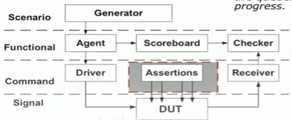

# Verification Plan
## 0. Testing Framework

### Generator

## 1. What resources will I need?
- SystemVerilog, Assertions, Specifications of Designs, the high level memory model

## 2. What should we verify?
- Read/Write functionalities
- Reset functionalities
- auto precharge functionalities
