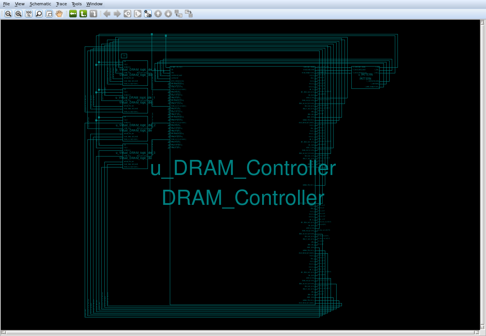
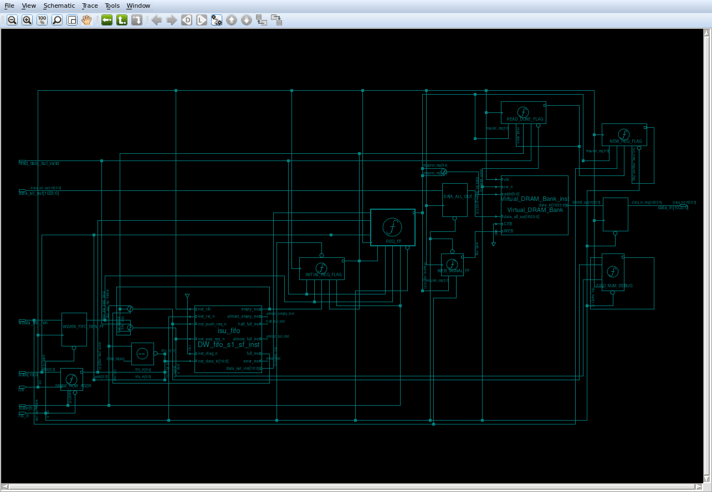
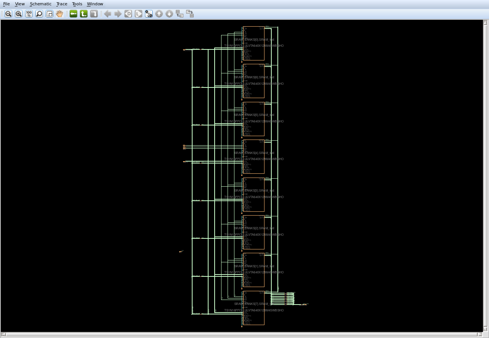

# DRAM_Global_Controller for TapeOut
- Since we do not have the real DRAM, this Project uses 1.25MB of SRAM to replace the DRAM, the detailed architecture can be seen from the report of the MCS project by HJ & YM

