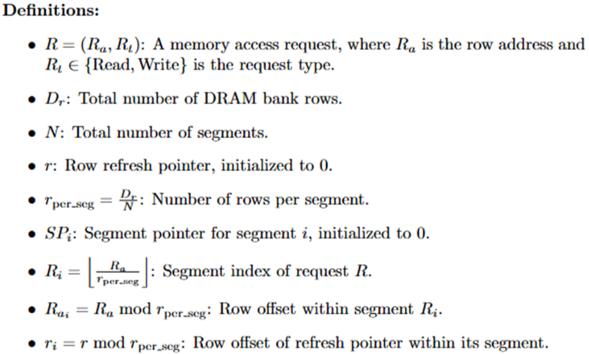
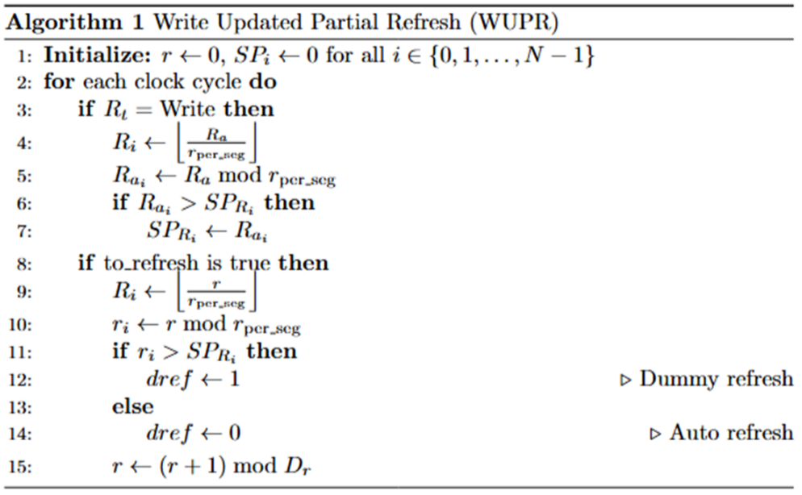

# Write Updated Partial Refresh

- Key idea: Some rows are not written to in the DRAM, so we can skip their refreshes Due to Sequential Access property of the workload uses segment pointers to track the last row written to in each segment ,the segment pointer is updated when a write command is issued
,the segment pointer is used to determine if a refresh is needed,if the segment pointer is less than the refresh row tracker for the corresponding segment, we can skip the refresh

