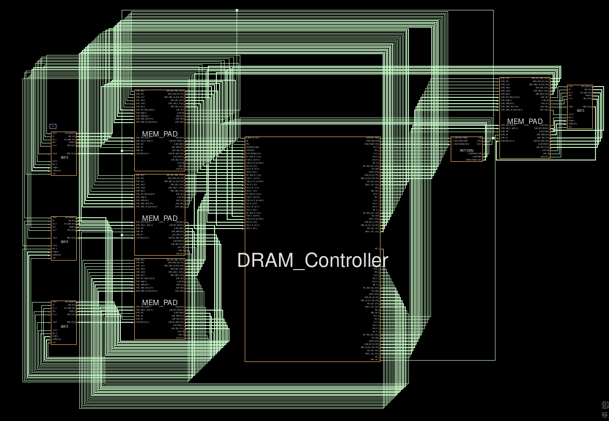
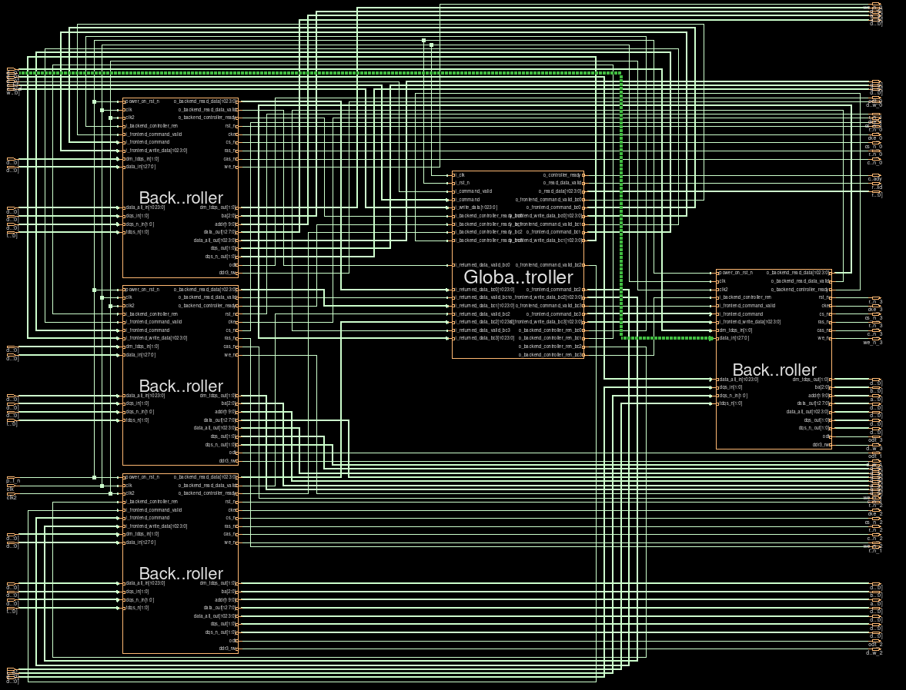
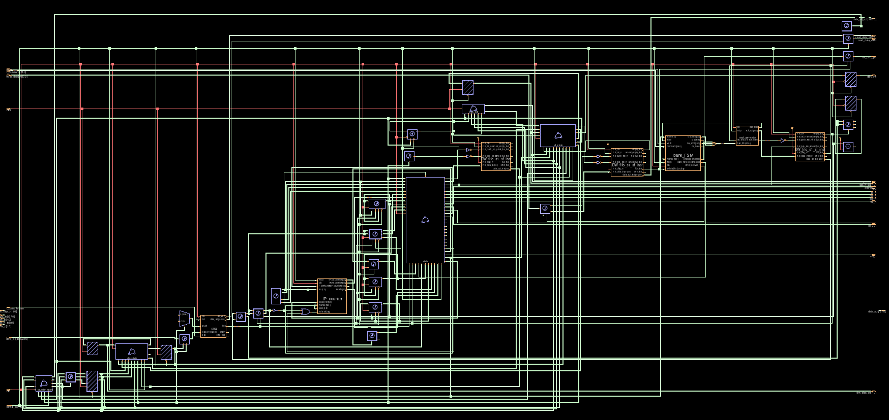

# RTL Design of DRAM Controller
- Memory Controllers folder has different DRAM controller components, the DRAM Controller one is the final version of the complete DRAM Controller and its test space
- The BackendController Contains the environment for a single Bank Level Controller
- Command Scheduler is the modified initial version with refresh command added, and the modified DRAM bank.

# How to get started?
- Survey [controller papers](https://drive.google.com/drive/u/0/folders/1yFMNl62fPAiir_vTnNnlBEVAEfrNsxpg) and some courses about how to build a DRAM Controller

- I suggest this [《SDRAM那些事儿》](https://www.youtube.com/watch?v=psaZpA8ZOZk&list=PLwQKrgJyAz7dy8qAdfTehBJcbJXuC4JgX&ab_channel=xiadaogu) courses to learn how to read the DRAM datasheet correctly

- Later use Verdi combined with the Architecture presented in my paper to trace and understand how a DRAM Bank level controller works with the DRAM bank

## Block Diagram from Verdi 

# References
- Chang_DDR has past senior's Original Unsynthesizable, without Refresh,without auto-precharge Design
- Fudan AXI DRAM Controller is a SDRAM Controller developed in the VIP lab of University of Fudan
- MICRON_DDR3_SDRAM has different version of orignal ddr3.v model for comparison
- sdrc_lite is another DRAM Controller design developed in the VIP lab